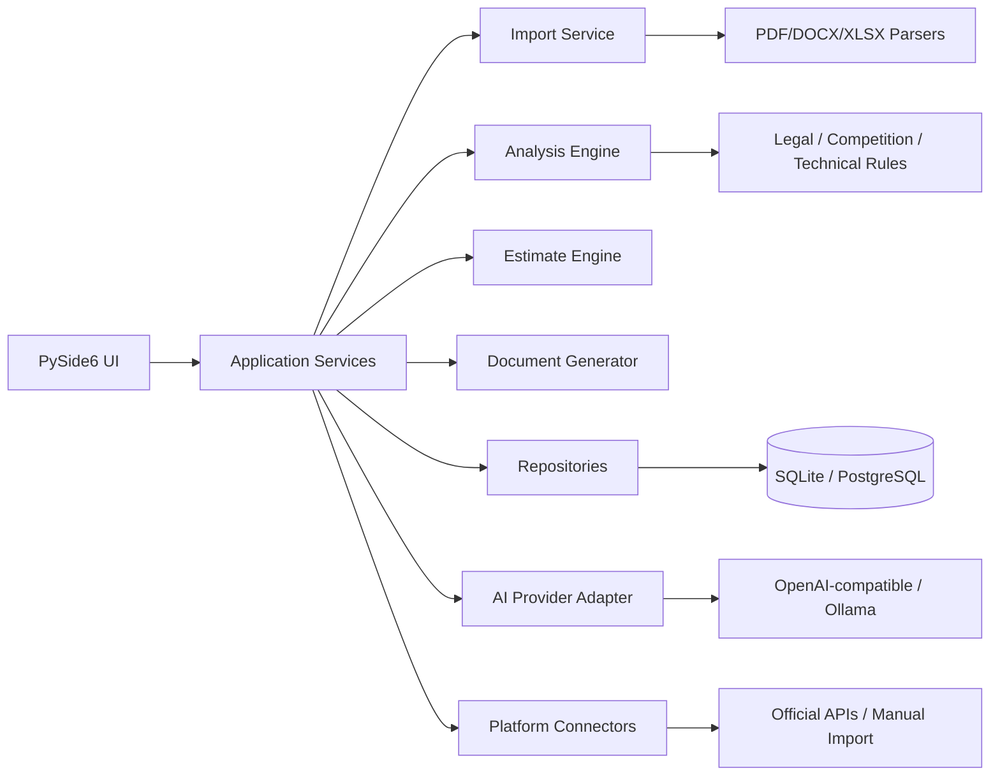

# Архитектурная схема

## База данных
Tender 1—N Document; Tender 1—N Analysis. Следующие сущности: Company, User, Role, Equipment, Supplier, Estimate, EstimateItem, GeneratedDocument, Task, Notification, AuditLog.
