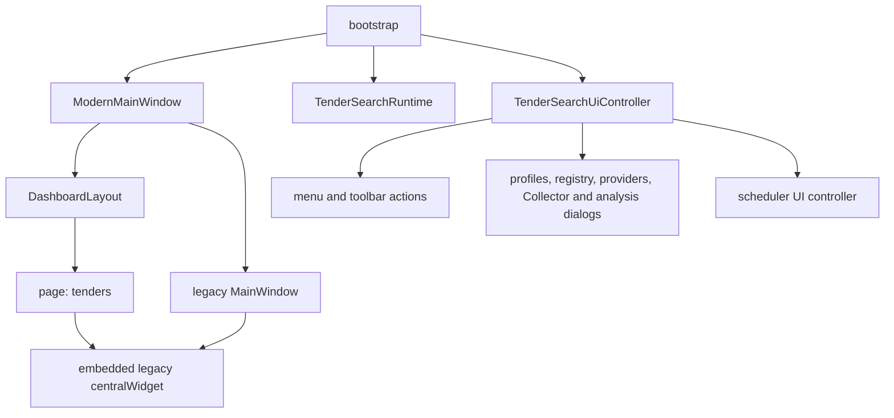
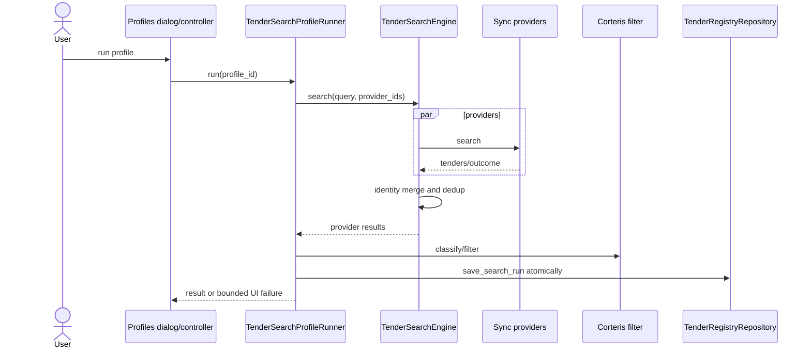
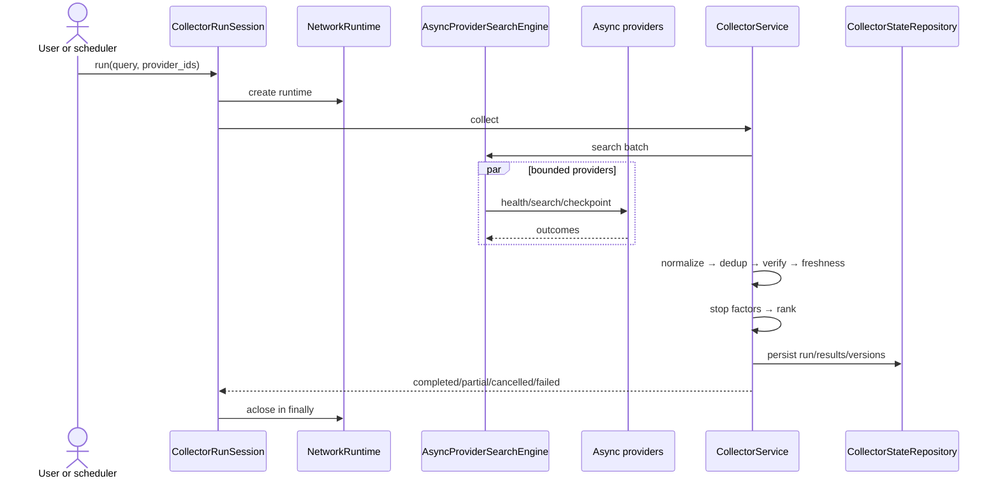
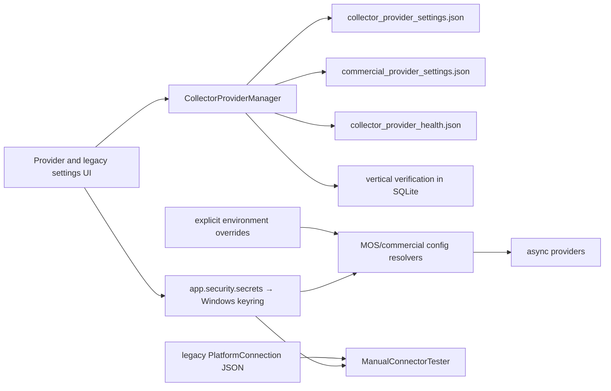
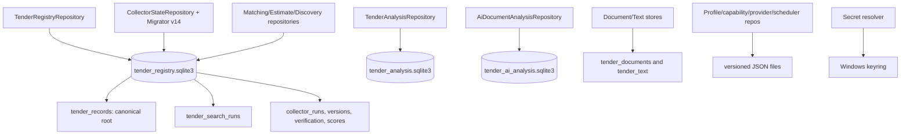
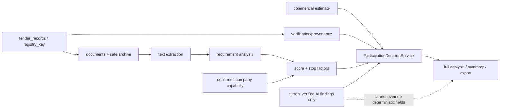
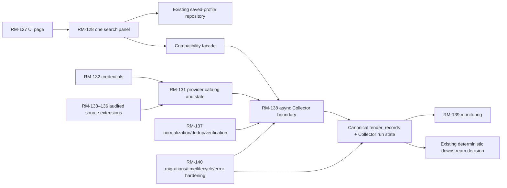

# RM-126 — аудит раздела «Тендеры»

## 1. Паспорт аудита

- Дата доказательного среза: `2026-07-16T00:22:03.9681831+03:00`.
- Baseline SHA: `7d51159a0fcbe21a457276ab29cc80fd1a2eb985` (`main` = `origin/main`).
- Ветка: `docs/rm-126-tenders-audit`; отдельный worktree.
- Среда: Windows 10 `10.0.19045.0`, `Russian Standard Time`/UTC+03:00, Python `3.12.7`.
- Scope: docs-only; production code, dependencies, DB schema и live network не изменялись.

## 2. Entry gate

Gate **PASSED** до создания audit branch:

- RM-125 имеет статус `DONE`; PR #53 merged как `bdceb70f0df1632baf83db4131a7ac4ed6215349`.
- Post-merge Quality Gate run `29450245855`: Windows Python 3.12 и 3.13 — `success`.
- Docs-only closeout PR #54 merged как baseline `7d51159a`.
- `docs/STATUS.md` и `docs/ROADMAP.md`: только RM-126 — `IN PROGRESS`.
- Основной checkout содержал известные untracked `.agents/` и `skills-lock.json`; они не изменены и
  не перенесены в audit worktree.
- WMI-запрос OS вернул `Access denied`; OS подтверждена read-only .NET API. Это ограничение
  окружения, не дефект репозитория.

## 3. Проверенный контур

Проверены canonical roadmap/DoD/history, bootstrap/composition root, modern и embedded legacy UI,
sync profile search, async Collector C1–C20, provider factories/catalogs, profiles/matching/capability,
settings/keyring/manual connector, все tender storage, scheduler/lifecycle, downstream full analysis и
deterministic participation decision. Статический анализ сверялся с реальными call sites и tests.

## 4. Executive conclusion

Текущая система функционально богата и baseline полностью зелёный, но раздел «Тендеры» не является
одной архитектурной boundary. Modern shell встраивает целиком legacy central widget; sync search и
async Collector независимо владеют provider orchestration, parallelism, merge/dedup и run history.
Collector — более полный целевой runtime: cancel, partial results, health/circuit breaker/checkpoints,
normalization, verification/provenance, freshness, ranking/stop factors, scheduler и notifications.

Принято: RM-127 выделяет одну tender page; RM-128/RM-138 переводят UI на async Collector через
compatibility facade; `TenderSearchProfileRepository`, `CollectorProviderManager`, keyring contract и
shared `tender_records` переиспользуются. Big-bang rewrite запрещён. Блокеров публикации docs-only
аудита нет. До application-кода RM-127 нужно закрыть merge + post-merge gate + отдельный closeout.

## 5. Current UI architecture

`bootstrap()` создаёт `ModernMainWindow`, затем единственный `TenderSearchUiController` с заранее
скомпонованным `TenderSearchRuntime`. Modern window создаёт скрытый legacy `MainWindow`, извлекает
его весь `centralWidget` и регистрирует как страницу `tenders`. Tender controller добавляет menu,
toolbar и dialogs поверх этого дерева. Dashboard navigation только выбирает страницу; topbar global
search переносит текст в legacy `catalog_query` с контрактом «Поиск по прайсу», а не запускает tender
query.

## 6. User journey matrix

| Journey | Entry | Actual route | Result/state | Gap |
|---|---|---|---|---|
| Открыть тендеры | Dashboard action/sidebar | select `tenders` page | весь legacy workspace | tender content не изолирован |
| Global search | topbar | select tenders + set `catalog_query` | поиск по прайсу/оборудованию | не universal tender search |
| Saved profile search | menu/toolbar/Ctrl+Shift+F | profiles dialog → sync runner worker | filtered results + `tender_search_runs` | другой runtime, чем Collector |
| Collector | Ctrl+Shift+C | profile + enabled sources → Collector worker | verified/ranked persisted run | отдельный dialog/contract |
| Registry | Ctrl+Shift+R | shared `tender_records` dialog | documents/analysis/score actions | registry объединяет результаты, но run histories различны |
| Provider management | Ctrl+Shift+S | `CollectorProviderManager` | enable/check/configured states | legacy platform settings живут отдельно |
| Scheduled collection | Ctrl+Shift+P/timer | scheduler → same Collector start callback | manual/scheduled busy guard | timer не имеет explicit application shutdown |
| Full analysis | registry/results action | documents → text → requirements → score → decision → AI | persisted auditable artifacts | UI close не владеет всеми workers |

## 7. Sync profile search architecture

`create_tender_search_runtime()` без сети создаёт atomic JSON profile repository, sync provider
registry, thread-pool engine, filter/runner и registry. Сеть начинается только в `runner.run()`.
Engine запускает enabled providers в `ThreadPoolExecutor`, применяет общий timeout и first-seen merge.
Pending futures отменяются, но уже выполняющийся blocking call принудительно не прекращается.
Runner фильтрует и атомарно сохраняет run; persistence error опционален, если `persistence_required`
не включён.

## 8. Async Collector architecture

`CollectorRunSession` создаёт network runtime на run и всегда `aclose()` в `finally`.
`CollectorService` выполняет async provider batch, aggregator discovery, normalization, dedup,
field verification/conflicts, freshness, stop factors, ranking и одну persistence transaction. Engine
имеет semaphore, per-provider timeout, cancellation, health monitor, circuit breaker и checkpoints.
Cancellation прекращает pending work и сохраняет полученные данные как partial/cancelled, не verified
success. Scheduler использует тот же `try_start_collector` и busy guard.

## 9. Comparison matrix and target boundary

| Аспект | Sync profile search | Async Collector | Общий компонент | Расхождение | Канонический владелец | RM |
|---|---|---|---|---|---|---|
| Query model | `TenderSearchQuery` from profile | тот же query | `TenderSearchProfile` | разные UI start contracts | profile repository + facade | 128/130 |
| Provider contract | sync `TenderProvider` | async provider protocol | `ProviderDescriptor`, `UnifiedTender` | два transport contract | async + port adapter | 134/138 |
| Provider factory | default sync registry | async factory | EIS parser/config | отдельные catalogs | collector factory | 131/138 |
| Source catalog | placeholders + EIS | EIS/MOS + commercial definitions | `TenderSource` | ID/source overlaps | collector definitions | 131 |
| Enablement | descriptor/profile selection | JSON manager + commercial settings | descriptor defaults | distributed state | `CollectorProviderManager` | 131 |
| Credentials | provider-specific/legacy | env+keyring | keyring wrapper | UI contracts differ | secret-store contract | 132 |
| Health | provider method, limited use | monitor/manager/C19 | `ProviderHealth` | Collector richer | collector health | 136/139 |
| Timeout | overall thread timeout | per-provider async timeout | bounded values | running sync call survives | async engine | 138/140 |
| Parallelism | `ThreadPoolExecutor` | asyncio semaphore | deterministic output intent | separate engines | async engine | 138 |
| Cancellation | future cancel best effort | cooperative token + partial | none | sync not reliable | Collector cancellation | 138/140 |
| Normalization | provider parser/model | explicit normalizer | `UnifiedTender` | duplicated stages | Collector chain | 137 |
| Deduplication | first-seen merge | versioned cross-source dedup | identity/cross-source keys | provenance depth differs | Collector deduplicator | 137 |
| Filtering | Corteris filter | matching classifier/ranker | matching catalog | timing/semantics differ | matching profile facade | 129/137 |
| Ranking | sync relevance | participation score | classifier | Collector richer | Collector ranker | 129 |
| Stop factors | downstream only | in collection pipeline | stop engine | not at same stage | deterministic stop engine | 129/140 |
| Provenance | aggregated source metadata | field candidates/conflicts | source identity | sync coarse | Collector verification | 137 |
| Freshness | absent | aware UTC policy/reverification | timestamps | sync naive timing | Collector freshness | 139/140 |
| Persistence | `tender_search_runs` | `collector_runs` + versions | shared `tender_records` | dual histories | registry record + collector run | 140 |
| Run history | sync outcome/error | status/progress/checkpoints | DB path | schemas differ | collector history | 140 |
| UI | profiles/results | Collector progress dialog | controller | duplicated journeys | one search panel/facade | 127/128 |
| Scheduler | none | scheduler/notifications | profile IDs | Collector only | existing scheduler | 139 |
| Tests | engine/runner/UI | async/cancel/store/service | model/registry tests | no migration parity suite | combined transition suite | 138/140 |

Рассмотрены: (A) оставить оба равноправными — минимальная миграция, но сохраняет divergence; (B)
big-bang заменить sync — чисто, но высокий regression/rollback risk; (C) async Collector target + sync
facade/пошаговый retirement — требует parity work, зато использует C1–C20 и сохраняет UX. Выбран C.

## 10. Provider/source adapter inventory

| TenderSource | Provider ID | Port | Adapter | Factory | Connection | Status | Enablement | Credential owner | Tests |
|---|---|---|---|---|---|---|---|---|---|
| EIS | `eis` | sync | `EisTenderProvider` | default sync | public HTML | implemented | descriptor/profile | none | EIS/factory/search |
| EIS | `eis` | async | `AsyncEisTenderProvider` | async | public HTML async | implemented/limited | provider settings | none | async EIS/checkpoint |
| MOS_SUPPLIER | `mos_supplier` | async | `AsyncMosSupplierTenderProvider` | async | official bearer API | implemented, token required | provider settings | keyring/env | MOS/config/checkpoint |
| SBER_A | `sber_a` | sync | `PlaceholderTenderProvider` | built-in | unspecified | placeholder | descriptor/profile | legacy | registry/factory |
| RTS_TENDER | `rts_tender` | sync | placeholder | built-in | unspecified | placeholder | descriptor/profile | legacy | registry/factory |
| ROSELTORG | `roseltorg` | sync | placeholder | built-in | unspecified | placeholder | descriptor/profile | legacy | registry/factory |
| B2B_CENTER | `b2b_center` | sync | placeholder | built-in | unspecified | placeholder | descriptor/profile | legacy | registry/factory |
| TEK_TORG | `tek_torg` | sync | placeholder | built-in | unspecified | placeholder | descriptor/profile | legacy | registry/factory |
| GAZPROMBANK | `gazprombank` | sync | placeholder | built-in | unspecified | placeholder | descriptor/profile | legacy | registry/factory |
| COMMERCIAL | `commercial` | sync | placeholder | built-in | none | disabled placeholder | descriptor | none | registry/factory |
| B2B_CENTER | `b2b_center` | async | commercial access adapter | commercial catalog | access pending | honest placeholder | two JSON settings | keyring/env | catalog/adapter |
| GAZPROMBANK | `gazprombank` | async | commercial access adapter | commercial catalog | access pending | honest placeholder | two JSON settings | keyring/env | catalog/adapter |
| FABRIKANT | `fabrikant` | async | commercial access adapter | commercial catalog | access pending | honest placeholder | two JSON settings | keyring/env | catalog/adapter |
| TEK_TORG | `tek_torg` | async | commercial access adapter | commercial catalog | access pending | honest placeholder | two JSON settings | keyring/env | catalog/adapter |
| OTC | `otc` | async | commercial access adapter | commercial catalog | access pending | honest placeholder | two JSON settings | keyring/env | catalog/adapter |
| SBER_A | `sber_commercial` | async | commercial access adapter | commercial catalog | access pending | honest placeholder | two JSON settings | keyring/env | catalog/adapter |
| RTS_TENDER | `rts_commercial` | async | commercial access adapter | commercial catalog | access pending | honest placeholder | two JSON settings | keyring/env | catalog/adapter |
| ROSELTORG | `roseltorg_commercial` | async | commercial access adapter | commercial catalog | access pending | honest placeholder | two JSON settings | keyring/env | catalog/adapter |
| CUSTOM | legacy name | manual UI | `ManualConnectorTester` | legacy settings tab | API/RSS/FTP/FTPS | connection tester, not search adapter | `user_settings.json` | keyring `platform:<name>` | user settings only |
| CUSTOM | discovery identity | async queue | `AggregatorDiscoveryRepository` | Collector service | aggregator metadata | discovery, never official adapter | queue state | none | aggregator discovery |

EIS pair is `SAME_ADAPTER_DIFFERENT_PORT`: both reuse `EisHtmlParser`, config and URL/matching
helpers; sync is compatibility port. Commercial and sync pairs are `PLACEHOLDER_ONLY`, not duplicate
working adapters. `LegacySyncProviderAdapter` имеет no production/test call site и является
`COMPATIBILITY_WRAPPER`. `validate_unique_sources()` проверяет один sync registry и не обнаруживает
cross-factory collisions. `CUSTOM` discovery не получает право стать official source автоматически.

## 11. Profile, business and matching inventory

| Concept | Owner/storage | Purpose | Corteris-specific | Decision |
|---|---|---|---|---|
| Search profile | `TenderSearchProfileRepository`, `search_profiles.json` | reusable query/filter/provider IDs | directions, default laws/score | расширять schema in place (RM-130) |
| Business profile | будущая abstraction | reusable company/search policy | пока не выделена | проекция capability, не новый repository (RM-129) |
| Company capability | `CompanyCapabilityProfileRepository`, JSON | explicitly confirmed company facts/limits | текущие направления/финансы | versioned generalization, отдельно от search |
| Matching catalog | `MatchingCatalogRepository`, shared SQLite | terms/weights/OKPD2/exclusions/revisions | default Corteris terms | canonical matching owner; fix canonical term (RM-137) |
| Classifier/filter | `CorterisTenderClassifier/Filter` | explainable relevance | да | strategy over catalog, не profile storage |
| Participation profile | `CorterisCompanyProfile` projection | deterministic scoring | да | derive from capability only |
| Provider selection | `provider_ids` + manager enablement | run source set | нет | resolve through canonical catalog |
| Scheduler profile | profile ID + provider IDs | repeat existing query | нет | reference saved profile; no copy |

Built-in/custom merge, atomic replace и corrupt quarantine уже реализованы. Нужна schema migration,
а не второй repository. Matching `canonical_term` сохраняется, но `to_search_profile()` использует
`term`; это подтверждённый gap RM-137.

## 12. Settings, credentials and security map

| Data item | Class | Current owner | Storage | Read/write | Logged/exported | Target owner | RM |
|---|---|---|---|---|---|---|---|
| Enabled flag | non-secret | enablement + commercial repos | two atomic JSON files | manager/catalog | public boolean | manager façade | 131 |
| Priority | non-secret | descriptor/definition | code | factories | public | provider catalog | 131 |
| Endpoint | potentially private | legacy/commercial settings | JSON/env | settings/catalog | public endpoint may be shown | normalized catalog config | 131/133 |
| Username | private metadata | legacy PlatformConnection | `user_settings.json` | legacy UI/tester | UI table | protected provider metadata | 132/133 |
| API key/token | secret | keyring/env | Windows keyring/process | config resolver/replacement dialog | configured state; commercial currently has masked public payload | keyring, no masked value export | 132 |
| Password | secret | legacy keyring | Windows keyring | explicit tester | must not export | keyring | 132/134 |
| Health status | non-secret | provider manager | health JSON + verification DB | explicit check/UI | public | manager | 136/139 |
| Last error | potentially sensitive | health repo/manual tester | health JSON/UI | generic exception paths | may expose raw message | bounded error category | 136/140 |
| Last success | non-secret | health repo | health JSON | manager/UI | public | manager | 139 |

MOS dialog uses password echo and replacement-only save; secret is verified by reload but never shown.
Commercial catalog isolates keyring in tests when environment mapping is supplied and stores no key.
Однако `masked_api_key` является частью public payload, а generic health/manual/provider failures use
`str(exc)` and can reach JSON/UI. Manual connector accepts arbitrary endpoint and direct urllib/FTP,
with raw errors and no shared async limits/redaction; it runs only by explicit user action and is not a
production tender adapter. Это не publication blocker, но обязательный RM-132/134/136 guard.

## 13. Persistence ownership

| Storage | Version | Owner/keys | Writers/readers | Atomicity/corruption | Time/money | Secrets |
|---|---|---|---|---|---|---|
| `search_profiles.json` | v1 | profile repo/profile IDs | dialogs, runner | temp replace; corrupt quarantine/fail-open built-ins | aware UTC metadata; Decimal strings | no |
| `user_settings.json` | implicit | UserSettingsStore/platform names | legacy settings/bootstrap | direct write; malformed JSON raises | floats for general prefs | no credential values; username/endpoints yes |
| provider settings JSONs | v1 | enablement/commercial repos | manager/catalog | temp replace; corrupt → defaults | no timestamps/money | no |
| provider health JSON | v1 | check repo/provider IDs | manager/UI | temp replace; corrupt → empty | aware UTC strings intended | no, but raw errors risk |
| capability JSON | v1 | capability repo | capability dialog/scoring | temp replace; invalid → empty profile | aware confirmation; Decimal strings | no |
| schedule/notifications JSON | repository schemas | scheduler/notification repos | scheduler UI | repository atomic paths | aware scheduler policy | no |
| `tender_registry.sqlite3` | registry v1 + collector migration v14 | `tender_records`; sync/collector runs; verification, score, matching, estimates | registry, Collector state and downstream repos | SQLite transactions; collector migrator/backup | Decimal text; mixed legacy/aware time gap | no |
| `tender_analysis.sqlite3` | repository DDL | analysis by registry key/fingerprint | requirement service | SQLite transaction | ISO metadata | no |
| `tender_ai_analysis.sqlite3` | payload v10 | AI repository/execution fingerprint | orchestrator/service | typed compatibility; corrupt/future rows skipped | aware execution provenance | no |
| `tender_documents/` + catalog | store schema | document identity/hash | download/full analysis | staged files + catalog | source metadata | no |
| `tender_text/` + catalog | store schema | extraction hash/version | text service | derived/rebuildable | metadata | no |
| Windows keyring | backend | secret name | credential dialogs/resolvers | backend semantics | n/a | yes, only allowed store |

`CollectorStateRepository.initialize()` first initializes `TenderRegistryRepository`, then applies
`CollectorSchemaMigrator`; оба используют `tender_records`. Registry owns canonical identity/upsert,
Collector owns run/version/verification state and may update a record only through explicit verified
field resolution. Incompatible root DDL не найден, но direct registry DDL + versioned collector DDL и
две run histories требуют consolidation plan RM-140. Sync persistence serializes naive timestamps as
naive and helper `_iso_timestamp` silently assigns UTC to naive values; Collector core uses aware UTC.

## 14. Lifecycle, background and scheduler

Per-operation guards существуют: search profile ID map, single Collector worker, per-registry analysis
maps, provider-check singleton, scheduler busy callback. Collector cancellation and runtime cleanup
корректны внутри run. SQLite connections открываются per operation с transactions.

Но `ModernMainWindow.closeEvent()` вызывает только `dashboard_controller.shutdown()` и закрывает
legacy window. `TenderSearchUiController` не предоставляет shutdown; его Collector/search/document/
analysis/provider workers не отменяются, global `QThreadPool` не ожидается, scheduler timer явно не
останавливается. Tests покрывают worker outcomes/cancel и scheduler behavior, но не close during each
operation. Возможны late signals к уже закрытым widgets, продолжающийся network/SQLite work и
scheduled start в shutdown window. Это HIGH lifecycle finding RM-140.

## 15. Downstream decision boundary

Canonical `registry_key` проходит из `tender_records` в documents, safe archive, text, requirements,
capability projection, commercial estimate, score, stop assessment, decision, AI orchestrator,
full-analysis summary/recheck/export. Verification status и field provenance сохраняются отдельно от
raw tender card. Missing documents/money/verification produce missing/data-insufficient evidence, а не
выдуманные значения.

`ParticipationDecisionService` сначала проверяет stop status: `BLOCKED_BY_REQUIREMENT` немедленно
возвращает `DO_NOT_PARTICIPATE`; missing score/estimate/verification даёт `DATA_INSUFFICIENT`;
conditional stop/verified AI findings могут только потребовать review. `SafeTenderSummaryEnhancer`
заменяет только wording и копирует facts/risks/stop factors/recommendation неизменными.

## 16. C1–C20 integration map

| C | Commit | Functionality / production area | Tests | Status | Primary RM | Reuse/consolidation | Duplicate risk |
|---|---|---|---|---|---|---|---|
| C1 | `780a1ec` | architecture baseline | baseline contract | done | 126 | this audit supersedes roadmap | low |
| C2 | `c3c8293` | async HTTP/engine/rate limit | async core | done | 138 | target parallel runtime | high if third engine |
| C3 | `1a72c40` | normalize/dedup/change history | normalizer/dedup/store | done | 137 | canonical chain | high vs sync merge |
| C4 | `0ae8a4d` | native async EIS | async EIS/checkpoint | done/limited | 138 | shared parser, async target | medium sync port |
| C5 | `92be284` (+ fixes) | MOS official API | MOS/config/checkpoint | done, token needed | 131 | canonical source definition | low |
| C6 | `81db5bc` | commercial catalog/access adapters | catalog/adapter | placeholder honest | 131 | canonical planned catalog | medium sync placeholders |
| C7 | `27562ed` | provider management | manager/UI | done | 131 | canonical façade | high legacy settings |
| C8 | `ba78ed6` | progress/cancellation/partial | progress/cancel/service | done | 138 | preserve contract | low |
| C9 | `f4cb7cd` (+ `180ff55`) | scheduler/notifications/timezone | scheduler/UI/notifications | done | 139 | reuse state/timer | medium lifecycle |
| C10 | `4a666f6` | explainable participation score | score/service/UI | done | 129 | derive from capability | low |
| C11 | `c395f3a` | safe full analysis workflow | full analysis/UI | done | 127 | one workflow only | high if UI duplicates |
| C12 | `1d58ef5` | Windows EXE release pipeline | build/release smoke | done | 140 | regression gate | low |
| C13 | `6be4791`, `872e849`, `504ab28` | provenance/verification/review | verification/store/UI | done | 137 | canonical verified boundary | low |
| C14 | `671d94b`, `ea47b7d` | freshness/timezone | freshness/store | partial: legacy time gap | 140 | enforce globally | high data semantics |
| C15 | `5051453` | company capability | capability/UI | done | 129 | generalize in place | medium profile confusion |
| C16 | `7d766c3` | stop-factor engine | stop tests | done | 129 | preserve absolute priority | low |
| C17 | `02b6f58` | editable matching catalog | matching tests | partial canonical term | 137 | canonical matching owner | medium |
| C18 | `dca0994` | commercial estimator | estimate/decision tests | done | 140 | downstream invariant | low |
| C19 | `adefc6f`, `ab8f8f9` | live verification gate/offline finalization | vertical verification | offline done; live unverified | 136 | health is not verification | medium fake success |
| C20 | `e688154` | aggregator discovery/official queue | discovery tests | done | 139 | reuse queue/state | medium if treated official |

## 17. Findings register

### RM126-F-001 — embedded legacy tender workspace

- **Status:** CONFIRMED; **Severity:** HIGH; **Area:** UI.
- **Evidence:** `app/ui/modern_main_window.py` creates legacy `MainWindow`, moves its central widget to
  page `tenders`; global search writes `catalog_query`; bootstrap installs one tender controller.
- **Current owner:** ModernMainWindow/MainWindow. **User impact:** mixed navigation and search meaning.
- **Data/security:** none direct. **Duplicate risk:** high if RM-127 builds a second workflow.
- **Recommendation / Target:** extract one page incrementally; RM-127/128.
- **Acceptance:** no hidden legacy shell ownership; all current actions reachable; topbar has one tender
  query contract; Qt navigation/close tests pass.

### RM126-F-002 — two independent search orchestration paths

- **Status:** CONFIRMED; **Severity:** HIGH; **Area:** SEARCH.
- **Evidence:** sync `TenderSearchEngine/TenderSearchProfileRunner` versus async
  `AsyncProviderSearchEngine/CollectorService`; distinct merge/cancel/history/UI paths and tests.
- **Owner:** search runtime + Collector. **Impact:** inconsistent results/progress/error semantics.
- **Data/security:** dual run histories/provenance depth. **Duplicate risk:** high.
- **Recommendation / Target:** async target, sync facade then retirement; RM-128/138/140.
- **Acceptance:** parity suite, one UI boundary, cancellable timeout, documented rollback and no third engine.

### RM126-F-003 — split provider catalog and settings ownership

- **Status:** CONFIRMED; **Severity:** MEDIUM; **Area:** PROVIDER.
- **Evidence:** sync placeholders, async factory, commercial definitions, two enablement JSONs and legacy
  `PlatformConnection`; uniqueness validation is registry-local.
- **Owner:** factories/CollectorProviderManager/UserSettingsStore. **Impact:** duplicate/contradictory state.
- **Data/security:** endpoint/private metadata distributed. **Duplicate risk:** high.
- **Recommendation / Target:** descriptor catalog + manager façade migration; RM-131/133.
- **Acceptance:** cross-factory identity validation, deterministic migration, one displayed state per source.

### RM126-F-004 — tender background work has no application shutdown owner

- **Status:** CONFIRMED; **Severity:** HIGH; **Area:** LIFECYCLE.
- **Evidence:** controller worker maps/singletons and scheduler timer exist; no controller shutdown;
  modern close only shuts Dashboard. No close-during-operation test found.
- **Owner:** TenderSearchUiController/ModernMainWindow. **Impact:** late signals, continued work on exit.
- **Data/security:** concurrent SQLite/network during teardown. **Duplicate risk:** low.
- **Recommendation / Target:** idempotent bounded shutdown; RM-140.
- **Acceptance:** cancel/wait every worker class, stop timer, no scheduled restart, runtime closes once; race tests.

### RM126-F-005 — timezone policy is not enforced at all boundaries

- **Status:** CONFIRMED; **Severity:** HIGH; **Area:** DATA.
- **Evidence:** `UnifiedTender` accepts naive datetime; sync engine uses naive `datetime.now()`;
  registry preserves naive ISO and another helper assigns UTC via `replace(tzinfo=UTC)`; Collector is aware.
- **Owner:** model/adapters/registry. **Impact:** wrong deadlines/freshness/order.
- **Data/security:** silent temporal corruption. **Duplicate risk:** medium parallel policies.
- **Recommendation / Target:** reject or explicitly mark unknown timezone at adapter boundary; RM-140.
- **Acceptance:** mixed/naive fixtures cannot silently become UTC; Moscow/source offset round trips; DST tests.

### RM126-F-006 — raw exception text can reach persisted/public errors

- **Status:** CONFIRMED; **Severity:** MEDIUM; **Area:** SECURITY.
- **Evidence:** sync outcomes, provider health generic catch and manual tester use `str(exc)`; health JSON/UI
  persists last error. Async HTTP sanitizes URL, but generic/provider payload paths remain.
- **Owner:** error boundaries/provider manager/manual tester. **Impact:** technical/private details exposed.
- **Data/security:** endpoint, backend or server text may leak; no secret leak reproduced.
- **Duplicate risk:** medium if each adapter invents errors. **Recommendation / Target:** typed bounded errors;
  RM-132/136/140.
- **Acceptance:** adversarial exception with token/user-info is redacted in DB/JSON/log/UI/export.

### RM126-F-007 — legacy manual connector is an unsafe future extension boundary

- **Status:** CONFIRMED; **Severity:** MEDIUM; **Area:** SECURITY.
- **Evidence:** active legacy UI calls `ManualConnectorTester` for user endpoint via urllib or FTP/FTPS;
  no shared scheme/host policy, async cancellation, response error redaction or provider registration contract.
- **Owner:** legacy settings/manual connector. **Impact:** inconsistent connection test; not tender search.
- **Data/security:** arbitrary network target and plaintext FTP option. **Duplicate risk:** high for RM-133–136.
- **Recommendation / Target:** do not promote; replace with declarative audited strategies; RM-133–136.
- **Acceptance:** allowlisted protocols, TLS/limits/cancel/redaction, explicit action, disabled default, no code exec.

### RM126-F-008 — shared registry has two run histories and mixed schema ownership

- **Status:** CONFIRMED; **Severity:** MEDIUM; **Area:** DATA.
- **Evidence:** registry direct DDL owns `tender_records/tender_search_runs`; collector migrator v14 owns
  `collector_*`; Collector initializes registry first; both use one SQLite file.
- **Owner:** registry and collector repositories. **Impact:** ambiguous history/retention/migration.
- **Data/security:** no incompatible root upsert reproduced. **Duplicate risk:** medium.
- **Recommendation / Target:** retain canonical record, migrate history with versioned backup; RM-140.
- **Acceptance:** old DB upgrade/rollback, identity parity, no record loss, one documented run-history API.

### RM126-F-009 — sync timeout cannot stop already running provider I/O

- **Status:** CONFIRMED; **Severity:** MEDIUM; **Area:** LIFECYCLE.
- **Evidence:** executor `shutdown(wait=False, cancel_futures=True)` only cancels pending futures; blocking
  provider call may continue. Async Collector has cooperative cancellation/timeouts.
- **Owner:** TenderSearchEngine. **Impact:** operation appears finished while I/O continues.
- **Data/security:** teardown race; possible late side effect. **Duplicate risk:** high if patched separately.
- **Recommendation / Target:** route through async engine/facade; RM-138/140.
- **Acceptance:** hung provider cancellation test proves bounded no-late-result behavior.

### RM126-F-010 — matching canonical term is persisted but unused

- **Status:** CONFIRMED; **Severity:** MEDIUM; **Area:** SEARCH.
- **Evidence:** catalog row/payload includes `canonical_term`; `to_search_profile()` builds rules and
  weights from `item.term` only.
- **Owner:** MatchingCatalog. **Impact:** synonyms/transliterations cannot collapse to canonical intent.
- **Data/security:** deterministic relevance divergence. **Duplicate risk:** medium.
- **Recommendation / Target:** define canonical-term semantics in sole normalizer; RM-137.
- **Acceptance:** golden catalog test covers synonym/transliteration, explanation and old revision migration.

### RM126-F-011 — C19 working status still requires authorized live verification

- **Status:** NEEDS_RUNTIME_VERIFICATION; **Severity:** INFO; **Area:** PROVIDER.
- **Evidence:** vertical state distinguishes successful health from C19 working; audit did not use network.
- **Owner:** VerticalSourceVerificationRepository. **Impact:** UI honestly reports unverified.
- **Data/security:** prevents fake success. **Duplicate risk:** low.
- **Recommendation / Target:** retain explicit live-run procedure; RM-136.
- **Acceptance:** authorized live fixture records contract evidence; offline remains `UNVERIFIED_EXTERNAL`.

### RM126-F-012 — commercial public payload derives a masked secret value

- **Status:** CONFIRMED; **Severity:** MEDIUM; **Area:** SECURITY.
- **Evidence:** `CommercialProviderResolvedSettings.masked_api_key` reads the resolved key and
  `public_payload()` publishes its first/last characters; the contract is asserted by
  `tests/test_commercial_provider_catalog.py`. No production UI caller was found.
- **Owner:** commercial provider catalog. **Impact:** dormant public contract can disclose a credential
  fragment if reused by RM-131/132 UI/export.
- **Data/security:** secret-derived data crosses the public payload boundary. **Duplicate risk:** low.
- **Recommendation / Target:** publish only `api_key_configured: bool`; RM-132.
- **Acceptance:** public payload/UI/export are identical for any two non-empty keys and contain no
  character derived from either value; fake-keyring tests confirm no read-for-display path.

## 18. Test coverage and gaps

Focused inventory: 105 tender/collector test files plus bootstrap tender integration; baseline
`395 passed in 36.20s`, final audit branch `395 passed in 33.99s`. Covered: models/money, profiles,
sync engine/timeout/dedup, native providers, async core,
cancel/partial, normalize/dedup/change, store/migrations, verification, freshness, scoring/stop,
scheduler/notifications, dialogs/controllers and downstream analysis. Full suite: 1496 tests.

Gaps handed off: application close while each worker runs; cross-factory provider uniqueness;
sync→async parity/migration; naive/source-timezone rejection; adversarial raw-error redaction across
DB/UI/export; legacy connector protocol security; dual run-history migration/rollback; C19 authorized
live evidence. Absence of a test was not used as proof that behavior is absent.

## 19. Chosen target boundaries (D-01–D-10)

| Decision | Alternatives considered | Chosen boundary and reason | Main risk / guard |
|---|---|---|---|
| D-01 UI | keep embedded; replace all; extract page | incremental extraction into modern page; preserves actions/rollback | legacy leakage → component inventory tests |
| D-02 Search | dual forever; big-bang; async+facade | async Collector target + sync compatibility facade | parity → golden result/cancel suite |
| D-03 Catalog | sync; commercial; unified descriptors | collector definitions/`ProviderDescriptor` source-of-truth | ID migration → alias table/collision test |
| D-04 State | new store; preserve split; façade+migrate | manager façade over existing stores, then consolidate | data loss → atomic migration/backup |
| D-05 Credentials | JSON; custom vault; keyring | existing keyring contract, env explicit override | backend errors → typed redaction |
| D-06 Profiles | second universal repo; extend existing | extend saved search repo; capability/matching remain distinct | schema compatibility tests |
| D-07 Normalize | sync; Collector; third chain | Collector normalizer/dedup/verification | behavior change → golden parity and provenance |
| D-08 Persistence | new DB; one repository class rewrite; shared ownership | registry canonical record + collector versioned state | mixed DDL → migrator/backup/rollback |
| D-09 Time/money | tolerate naive/float; infer zone; strict | Decimal+currency and aware time; unknown is explicit | old data → staged migration/quarantine |
| D-10 C1–C20 | parallel roadmap; discard; distribute | assign every C item to exactly one RM | duplicate delivery → requirements matrix |

## 20. Blockers and handoff

Publication blockers: **none**. HIGH findings F-001/F-002/F-004/F-005 are future implementation
constraints, not evidence corruption in this docs-only PR. RM-127 may start only after RM-126 audit PR
merge, green post-merge Windows gate, docs-only closeout merge and final green gate. RM-127 scope is
only UI isolation; it must not redesign search, adapters, DB, profiles or decision logic.

## 21. Baseline and acceptance results

Baseline on `7d51159a` (Python 3.12.7, Windows): target `395 passed in 36.20s`, full
`1496 passed in 63.74s`; все остальные workflow checks также успешны.

Final acceptance on audit branch:

| Check | Exact result |
|---|---|
| Secret scan | `Repository secret scan passed.` |
| Ruff check | `All checks passed!` |
| Ruff format | `523 files already formatted` |
| mypy | `Success: no issues found in 20 source files` |
| offline credential smoke | `2 passed in 5.39s` |
| migration smoke | `5 passed in 3.82s` |
| import smoke | `DashboardController` |
| bootstrap composition smoke | `1 passed in 0.37s` |
| build/release smoke | `6 passed in 4.60s` |
| target tender/collector contour | `395 passed in 33.99s` |
| full pytest | `1496 passed in 61.27s (0:01:01)` |
| dependency audit | `No known vulnerabilities found`; editable project skipped |
| diff check | success; worktree clean before audit files |

Первый pytest был заблокирован чужим недоступным Windows Temp directory; focused reproduction
подтвердила environment-only `PermissionError`. Повтор с gitignored repository `--basetemp=.tmp/...`
прошёл. Первый pip-audit был заблокирован sandbox socket policy; повтор с разрешённым network доступом
успешен. Это не скрытые test failures.

Финальный acceptance после создания документов записан в этом разделе и в roadmap до PR.

## 22. Final audit decision

**ACCEPTED FOR AUDIT PR.** Текущая архитектура пригодна для безопасной поэтапной миграции при
соблюдении `docs/RM-126_REQUIREMENTS.md`. Канонические boundary D-01–D-10 выбраны, C1–C20 поглощены
RM-127–RM-140, findings имеют owners/acceptance. RM-126 пока остаётся `IN PROGRESS`; RM-127 не
активируется этим PR.

